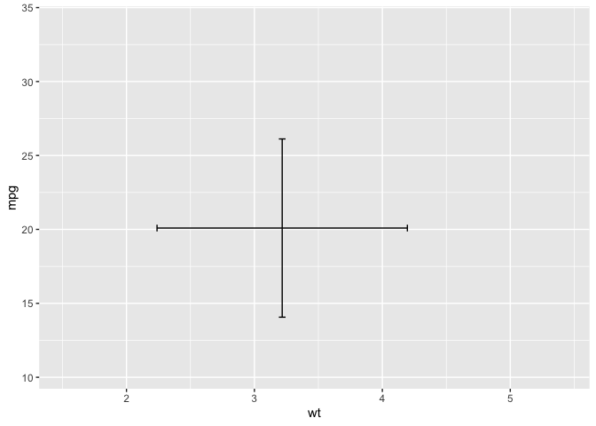

# README


## ggbotbar

Create plot with geom_errorbar + geom_errorbarh with constant cap width.

## Usage

Load packages.

``` r
library(tidyverse)
library(ggbothbar)

packageVersion("ggbothbar")
```

    [1] '1.0.0'

``` r
library(ggplot2)
ggplot(mtcars, aes(x = wt, y = mpg)) +
  geom_errorbarb()
```


