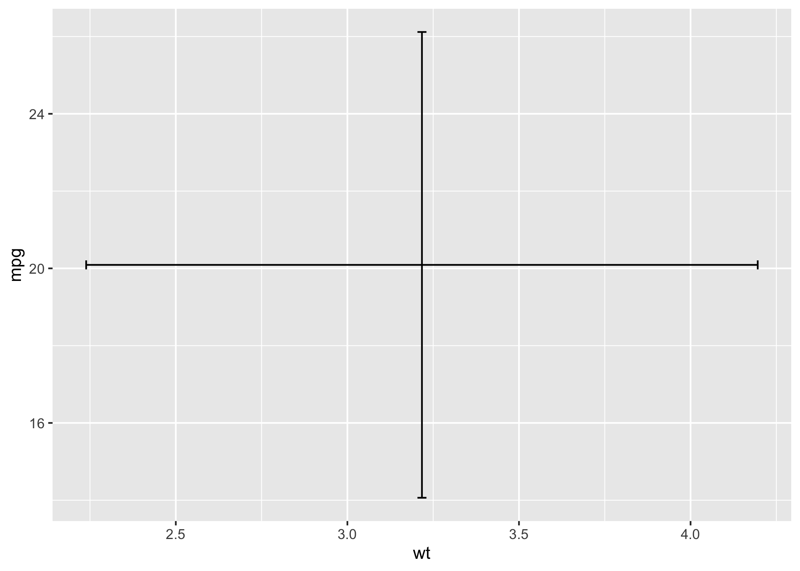
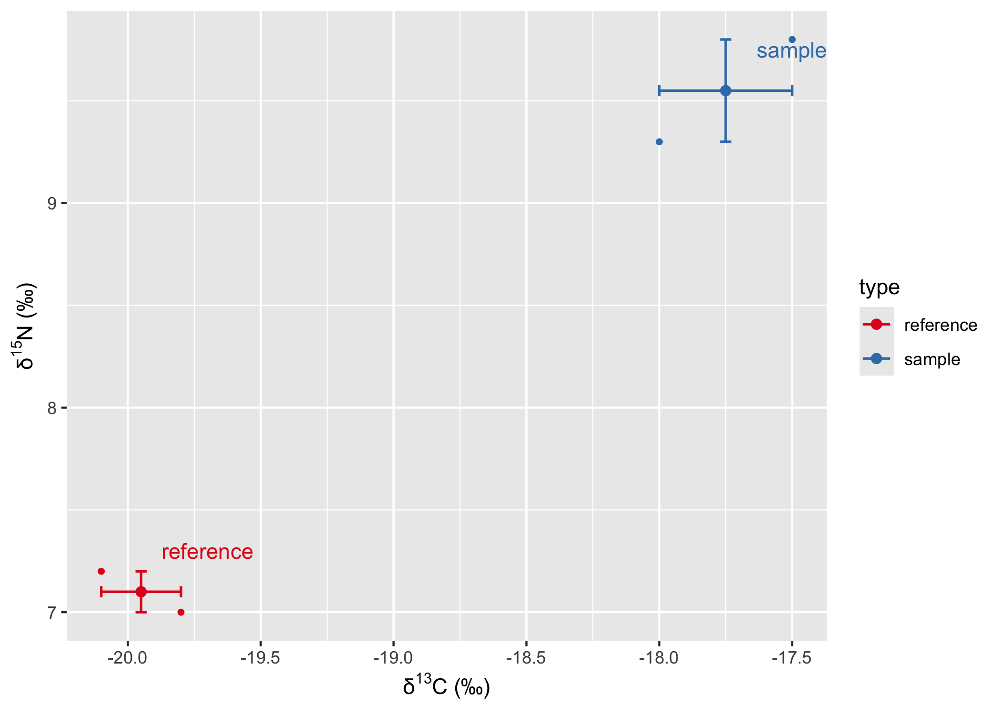
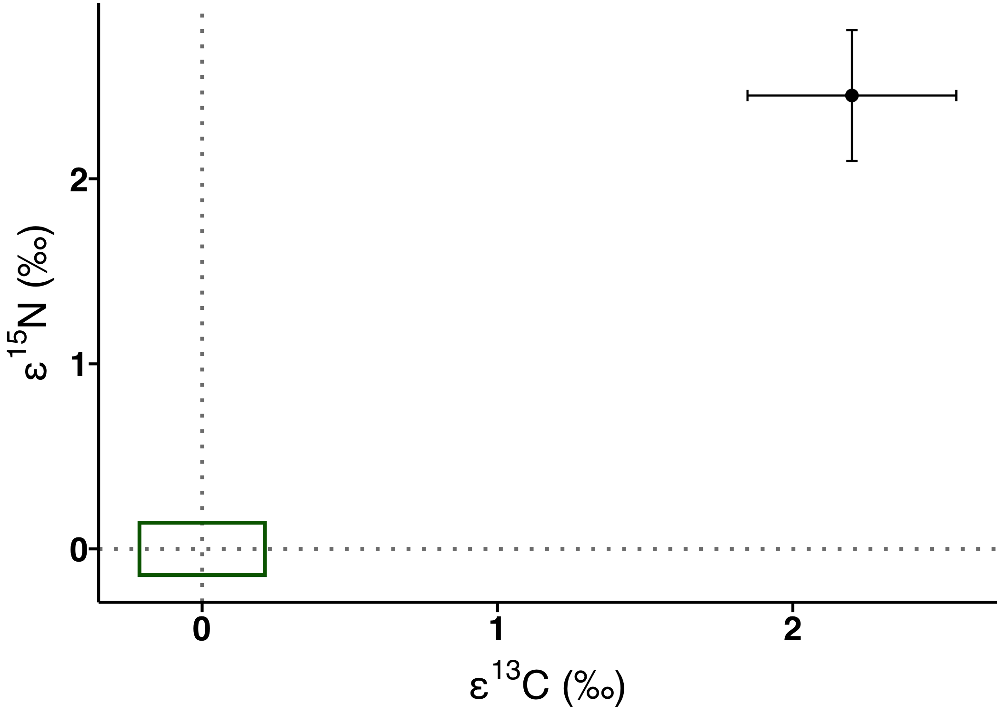

# ggbothbar


`ggbothbar` calculates and visualises isotopic enrichment and grouped
uncertainty, including two-axis error bars with a constant physical cap
width.

## Usage

Load packages.

``` r
library(ggbothbar)

packageVersion("ggbothbar")
```

    [1] '1.2.0'

``` r
library(ggplot2)
ggplot(mtcars, aes(x = wt, y = mpg)) +
  geom_errorbarb()
```



## Isotopic data workflows

The package includes helpers for mycoheterotrophic isotopic data. Start
from replicate measurements, calculate enrichment, then visualise
group-level uncertainty along both axes.

``` r
iso_raw <- data.frame(
  type = c("reference", "reference", "sample", "sample"),
  d13c = c(-20.1, -19.8, -17.5, -18.0),
  d15n = c(7.2, 7.0, 9.8, 9.3)
)

iso_enriched <- calc_enrichment(iso_raw, delta = c("d13c", "d15n"))
iso_enriched
```

           type  d13c d15n  e13c e15n
    1 reference -20.1  7.2 -0.15  0.1
    2 reference -19.8  7.0  0.15 -0.1
    3    sample -17.5  9.8  2.45  2.7
    4    sample -18.0  9.3  1.95  2.2

### Error bars in both directions

`geom_errorbarb()` summarises each group into cross-shaped error bars.
Supply a grouping aesthetic so replicates for the same taxon or
treatment are combined.

``` r
ggplot(
  iso_enriched,
  aes(d13c, d15n, colour = type, group = type, label = type)
) +
  geom_point(size = 1) +
  stat_mean_point(size = 2) +
  stat_mean_label(
    geom = "text",
    position = position_nudge(x = 0.25, y = 0.2),
    show.legend = FALSE
  ) +
  geom_errorbarb(fun.errorbar = "se", linewidth = 0.6, errorbar_tip_size = 2) +
  scale_colour_brewer(palette = "Set1") +
  labs(x = label_isotope(13, "C"), y = label_isotope(15, "N"))
```



### Enrichment factor with Error boxes

``` r
ggplot() +
  geom_hline(yintercept = 0, linetype = "dotted", colour = "grey50") +
  geom_vline(xintercept = 0, linetype = "dotted", colour = "grey50") +
  stat_mean_point(
    data = subset(iso_enriched, type != "reference"),
    mapping = aes(x = e13c, y = e15n),
    size = 2
  ) +
  geom_errorbarb(
    data = subset(iso_enriched, type != "reference"),
    mapping = aes(x = e13c, y = e15n),
    fun.errorbar = "sd"
  ) +
  geom_errorbox(
    data = subset(iso_enriched, type == "reference"),
    mapping = aes(x = e13c, y = e15n),
    fill = NA,
    fun.errorbar = "sd",
    colour = "darkgreen"
  ) +
  labs(x = label_isotope(13, "C", "epsilon"), y = label_isotope(15, "N", "epsilon")) +
  theme_aca(base_family = "sans")
```



## Spreadsheet output

Google Sheets remains the default destination. Its client packages are
optional in ggbothbar 1.2.0, so install them only when that workflow is
needed.

``` r
install.packages(c("googlesheets4", "googledrive"))

write_sheets(
  list(summary = iso_enriched),
  sheet_names = "summary",
  name = "isotope-summary"
)
```

Local xlsx output requires `openxlsx` and protects an existing
destination by default. Replacement must be explicit.

``` r
install.packages("openxlsx")

write_sheets(
  list(summary = iso_enriched),
  sheet_names = "summary",
  name = "isotope-summary",
  local = TRUE,
  overwrite = FALSE
)
```
